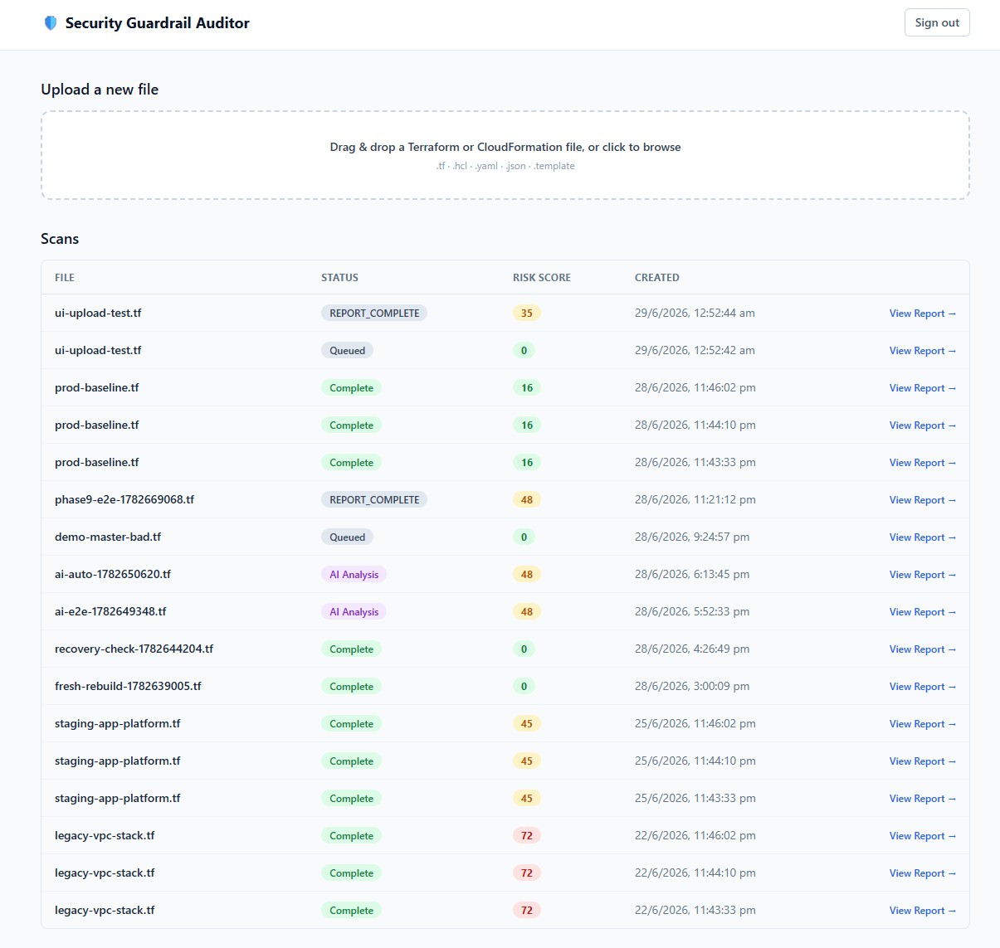
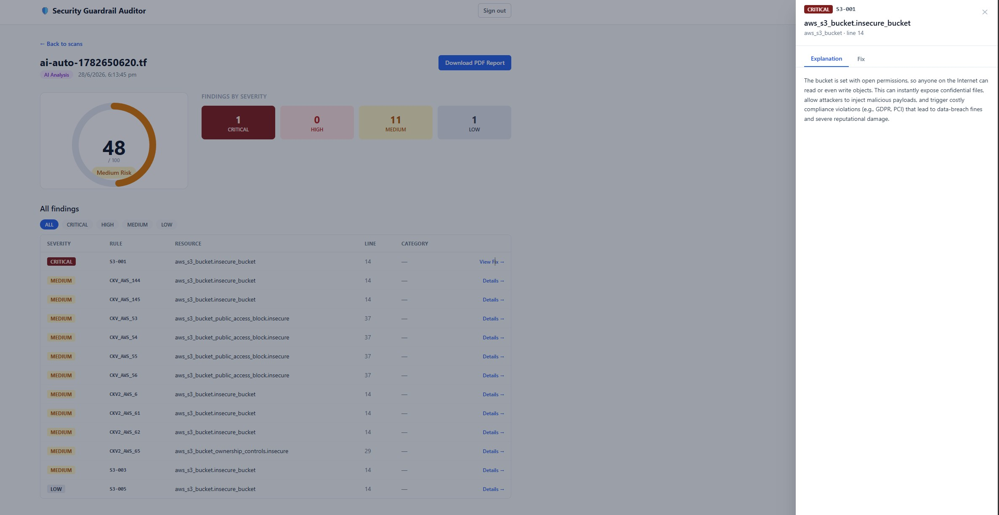
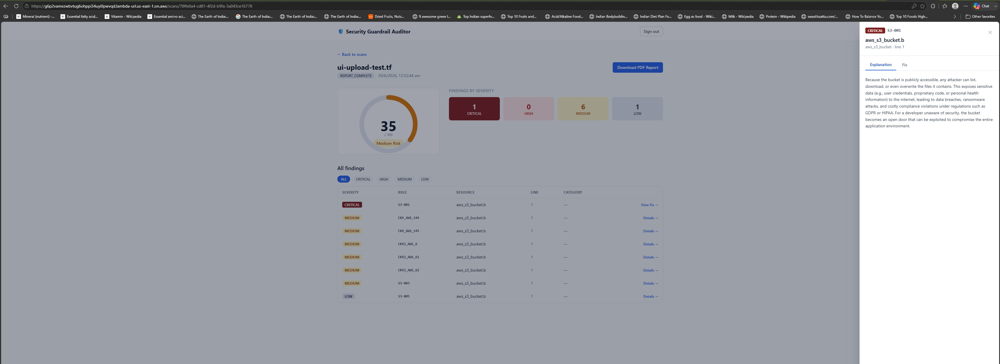

# Enterprise Security Guardrail Auditor

An AI-powered, fully serverless platform that scans Infrastructure-as-Code for security
misconfigurations, explains each risk in plain English, and generates the corrected code —
end-to-end in about a minute, for near-zero cost at idle.

[](https://aws.amazon.com/cdk/)
[](https://www.python.org/)
[](https://react.dev/)
[-232F3E?logo=amazonaws&logoColor=white)](https://aws.amazon.com/bedrock/)
[-6f42c1)](#cost)
[-2088FF?logo=githubactions&logoColor=white)](#engineering-quality)
[](LICENSE)

---

### At a glance

| | | | |
|---|---|---|---|
| **8** CDK stacks | **80** automated tests | **86.87%** backend coverage | **20+** custom rules |
| **7** Lambda functions | **2** Fargate scan tasks | **~60–90s** end-to-end scan | **< $5/mo** idle cost |

> Upload an Infrastructure-as-Code file. Get back a prioritised risk report —
> in plain English, with the exact fix, and a PDF in your inbox — in about a
> minute. Entirely serverless, so it costs roughly nothing when idle.

---

## What it does

The Guardrail Auditor scans **Terraform** and **CloudFormation** files for
security misconfigurations before they ever reach AWS. It runs two scan layers
(a custom 20-rule engine *and* the open-source Checkov scanner), then asks
**Amazon Bedrock (Claude)** to explain each finding in plain English and to
generate the corrected IaC. You get a visual Risk Score dashboard, an emailed
PDF report, and a one-click fix for every critical issue.

It is a production-grade, enterprise-patterned system: event-driven, secure by
default, fully observable, cost-engineered, and reproducible from a single command.

---

## Key capabilities

- **20+ built-in security rules** across S3, IAM, networking, encryption, and logging — plus the full Checkov ruleset (1,000+ checks) running in Fargate.
- **AI risk explanations** — every finding gets a 2–3 sentence plain-English explanation from Claude. No security jargon required to act on it.
- **AI auto-remediation** — every CRITICAL/HIGH finding ships with a generated, corrected IaC block you can paste straight back into your code.
- **Risk Score dashboard** — a single 0–100 score with colour-coded severity (green → amber → red → dark red), a sortable findings table, and a slide-in AI drawer.
- **Emailed PDF report** — a full report (all severities + compliant resources) lands in your inbox on completion, with a CRITICAL/HIGH summary in the body.
- **Serverless & event-driven** — no servers, no NAT gateway, no database to manage. ~$0 at idle.

---

## Skills demonstrated

This project was built to demonstrate the end-to-end skill set of a cloud / AI /
platform engineer who can own a system from architecture to production operations.

| Area | Demonstrated by |
|---|---|
| **Generative AI integration** | Amazon Bedrock (Claude) for risk explanation + code generation, prompt engineering, cost-aware model routing (Haiku for volume, Sonnet for precision), retry/backoff handling |
| **Serverless & event-driven architecture** | Lambda + Fargate + EventBridge + SQS choreography; every hop is an event, zero idle compute |
| **Infrastructure as Code** | 8 AWS CDK (TypeScript) stacks synthesising to CloudFormation; reproducible one-command build and teardown |
| **CI/CD & DevOps** | GitHub Actions with OIDC (no stored keys), multi-environment dev → staging → prod flow with approval gates, containerised deployments to ECR |
| **Cloud security** | Least-privilege IAM, KMS encryption, Cognito JWT auth, Secrets Manager, SigV4 presigned URLs — the system passes its own scanner cleanly |
| **Cost engineering** | Serverless-first design delivering < $5/month idle; no NAT/RDS/EC2; documented cost model |
| **Software design** | SOLID layered architecture (controllers → services → core → adapters), Open/Closed rule engine, dependency injection |
| **Testing & quality** | 80 automated tests, 86.87% backend coverage, static analysis (cfn-lint, tfsec, Checkov) on every PR |
| **Observability & operations** | CloudWatch dashboards + alarms, X-Ray distributed tracing, dead-letter queues, automated failure notifications |
| **Full-stack delivery** | React 18 + TypeScript SPA, REST API design, presigned-URL uploads, real-time status polling |

---

## Architecture

```
                      ┌─────────────┐
   Upload IaC ───────▶│  S3 uploads │──ObjectCreated──▶ EventBridge
   (dashboard /       └─────────────┘                       │
    presigned PUT)                                          ▼
                                                   ┌──────────────────┐
                                                   │  ingest (Lambda) │  create job (DynamoDB)
                                                   └────────┬─────────┘
                                                ScanRequested│
                                   ┌─────────────────────────┴───────────────┐
                                   ▼                                          ▼
                       ┌────────────────────┐                    ┌────────────────────┐
                       │ rules-engine (ECS) │                    │   checkov (ECS)    │
                       │  20 custom rules   │                    │  OSS scanner       │
                       └─────────┬──────────┘                    └─────────┬──────────┘
                                 │ findings                      SQS results│
                                 ▼                                          ▼
                           DynamoDB findings ◀────────────────  aggregator (Lambda) dedup
                                 │ ScanComplete
                                 ▼
                       ┌────────────────────┐   AIAnalysisComplete   ┌────────────────────┐
                       │ ai-analyzer Lambda │ ─────────────────────▶ │ report (Lambda)    │
                       │  Bedrock (Claude)  │                        │  PDF → S3          │
                       │ explain + fix +    │                        └─────────┬──────────┘
                       │ risk score         │              ReportGenerated      │
                       └────────────────────┘                                  ▼
                                                                    ┌────────────────────┐
   React dashboard ◀── API Gateway ── api Lambda ── DynamoDB        │ email (Lambda) SES │
   served by          (REST, Cognito JWT)                           │  PDF + summary     │
   API Gateway → Lambda → S3 bundle                                 └────────────────────┘

   Cross-cutting: CloudWatch dashboard + alarms, X-Ray tracing on every Lambda,
                  failure-handler (Lambda) on any ECS exit≠0 / DLQ → failure email.
```

**Flow:** upload → ingest → two-layer scan → aggregate → AI analysis → PDF report → email.
Every hop is an EventBridge event; every compute unit is a container image from ECR.

**Infrastructure notes (and why):**
- **Dashboard delivery = API Gateway → Lambda → S3 bundle, not CloudFront.** CloudFront
  Distribution creation is blocked on a fresh/unverified AWS account (`403 "account must
  be verified"`). Rather than block the whole product on a Support case, the dashboard is
  served by an **API Gateway HTTP API** whose `$default` route proxies to a small Lambda
  that streams the React bundle from the private S3 bucket. It needs no account
  verification, is `$0` idle (pay-per-request), terminates HTTPS, and reuses payload
  format 2.0 so the handler is identical to the earlier Function-URL host. The CloudFront
  path is kept in code but **gated off** (`--context cloudfrontEnabled=true`) as an optional
  upgrade once the account is verified — both read the same S3 bundle, so switching needs
  no rebuild.
- **All presigned URLs use AWS Signature V4.** Uploads and report downloads go through
  presigned S3 URLs against **KMS-encrypted** buckets, and S3 **rejects SigV2 against a
  KMS bucket** (`HTTP 400 … require AWS Signature Version 4`). The API's boto3 S3 client is
  pinned to `signature_version="s3v4"` so both the browser **upload** (presigned PUT) and
  the **PDF download** (presigned GET, with `Content-Disposition: attachment`) work.

---

## Engineering quality

Quality is treated as a first-class requirement, not an afterthought.

- **Automated testing** — 80 tests (74 Python unit/integration tests using `pytest` + `moto`
  for AWS mocking, plus 6 frontend tests with Vitest), holding **86.87% backend coverage**.
  A minimum coverage gate blocks merges below threshold.
- **Static security & lint gates on every PR** — `pytest`, `cfn-lint`, `tfsec`, and `Checkov`
  all run automatically via GitHub Actions; any failure blocks the merge.
- **Self-auditing infrastructure** — the project's own CDK output is scanned with Checkov
  against a documented accepted-risk baseline (`381 pass / 0 unaccepted findings`). The
  platform passes the same security bar it enforces on its users.
- **SOLID layered architecture** — a strict `controllers → services → core → adapters/rules`
  layering. Adding a new security rule or IaC parser is a new file with zero changes to
  existing code (Open/Closed principle).
- **Secure by default** — least-privilege IAM per function, KMS encryption at rest, Cognito
  JWT authentication on every API route, secrets isolated in Secrets Manager, and SigV4
  presigned URLs. No long-lived credentials anywhere (CI uses GitHub OIDC).
- **Operational maturity** — X-Ray tracing on every Lambda, CloudWatch dashboards and alarms,
  dead-letter queues with automated failure emails, and a one-command teardown to a $0 account.

---

## Tech stack

| Layer | Technology |
|---|---|
| Infrastructure | AWS CDK v2 (TypeScript) → CloudFormation |
| Compute | Lambda (container images) + ECS Fargate |
| Data | DynamoDB (pay-per-request), S3, Secrets Manager |
| Eventing | EventBridge, SQS |
| AI | Amazon Bedrock — Claude (Haiku explain / Sonnet fix) |
| Scanners | Custom Python rules engine + Checkov (OSS) |
| API | API Gateway REST + Cognito (JWT auth) |
| Frontend | React 18 + TypeScript + Vite + Tailwind, React Query, Amplify |
| Dashboard delivery | API Gateway (HTTP API) → Lambda → S3 bundle (CloudFront-free, see note) |
| Notifications | Amazon SES (PDF report email) |
| Observability | CloudWatch dashboard + alarms, AWS X-Ray |
| CI/CD | GitHub Actions (OIDC — no stored AWS keys) |

---

## Deploy it yourself

Prerequisites: an AWS account (CDK-bootstrapped), Docker, Node 20+, Python 3.12,
and Bedrock model access enabled in `us-east-1`.

```bash
# 1. Clone
git clone https://github.com/PuneetKumarSinghIT/guardrail-auditor.git
cd guardrail-auditor

# 2. Bootstrap CDK (once per account/region)
npx cdk bootstrap aws://<ACCOUNT_ID>/us-east-1

# 3. Bring up an entire environment (infra → images → Lambdas → seed rules)
AWS_PROFILE=<your-profile> scripts/deploy_env.sh dev
```

`deploy_env.sh` handles the ECR bootstrap ordering for you. Tear the whole thing
back down to a $0, empty account with one command:

```bash
AWS_PROFILE=<your-profile> npx cdk destroy --all --context env=dev --force
```

---

## Manual setup — one-time, in the AWS Console

CDK provisions every resource, but a few things **can only be enabled by a human
in the AWS Console** (AWS gates them behind account verification or a one-time
opt-in form). Do these once per account before the product is fully usable.

### 1. AWS account activation / verification (new accounts)
A brand-new or unverified AWS account ships with **reduced service limits** that
will block parts of this project until AWS verifies the account (this can take a
few hours to a couple of days after you add a payment method and use the account):

| Symptom you'll see | Root cause | What to do |
|---|---|---|
| CloudFront create → `403 "account must be verified"` | CloudFront gated on new accounts | Open a **Support case** (Account & Billing) asking to enable CloudFront; until then the dashboard runs on **API Gateway → Lambda** (already the default — no action needed). |
| Bedrock `InvokeModel` → `AccessDenied` / model not enabled | Model access not granted | Enable model access (step 3). |
| Lambda reserved concurrency deploy fails: `…below its minimum value of [10]` | Account Lambda concurrency quota = 10 | Request a **Lambda concurrency quota increase** (Service Quotas → Lambda → "Concurrent executions"). Until then leave `reservedConcurrency` off (the default). |

> You do **not** need CloudFront or a quota increase to run and demo the product —
> the defaults work on an unverified account. These only unlock optional hardening.

### 2. Create a Cognito login user
Self-signup is disabled, so create your demo user with the CLI (replace the pool id
from `aws ssm get-parameter --name /guardrail/dev/cognito-user-pool-id`):

```bash
POOL=$(aws ssm get-parameter --name /guardrail/dev/cognito-user-pool-id --query Parameter.Value --output text)

aws cognito-idp admin-create-user \
  --user-pool-id "$POOL" \
  --username you@example.com \
  --user-attributes Name=email,Value=you@example.com Name=email_verified,Value=true \
  --message-action SUPPRESS

# Set a permanent password (so there's no force-change-password prompt):
aws cognito-idp admin-set-user-password \
  --user-pool-id "$POOL" \
  --username you@example.com \
  --password 'YourStrongP4ss!' \
  --permanent
```

You now log in to the dashboard with `you@example.com` / `YourStrongP4ss!`.

### 3. Enable Bedrock model access (for AI explanations + fixes)
In the Console → **Bedrock → Model access → Manage model access**, enable:
- **Anthropic Claude Haiku 4.5** (used for risk explanations)
- **Anthropic Claude Sonnet 4.6** (used to generate the corrected IaC)

Anthropic models require accepting a short use-case form **in the Console** (this
step is not available via CLI). Once granted, set `BEDROCK_PROVIDER=anthropic` in
`infrastructure/lib/ai-stack.ts` and redeploy `GuardrailAi-{env}`. Until then the
analyzer uses a runtime-token bridge so the pipeline still produces AI output.

### 4. Verify SES email identities (sandbox)
The completion email is sent via **Amazon SES**, which starts in *sandbox* mode —
it can only send **to and from verified addresses**. Verify the address(es) you'll
use:

```bash
aws ses verify-email-identity --email-address you@example.com
# Click the confirmation link AWS emails you. Repeat for any other To/From address.
```

To send to arbitrary recipients (outside sandbox), request **SES production access**
in the Console (SES → Account dashboard → Request production access).

---

## Configure the email (To / From) facility

The PDF-report email is fully configurable. The From and To addresses live in
**one place** — a Secrets Manager secret seeded by CDK — so you can point the email
facility at whatever addresses a client needs.

**Where it's defined (in code):** `infrastructure/lib/foundation-stack.ts`

```ts
this.appSecret = new secretsmanager.Secret(this, 'AppSecrets', {
  secretName: `guardrail/${env}/app-secrets`,
  secretObjectValue: {
    ses_from_email: cdk.SecretValue.unsafePlainText('you@example.com'), // FROM
    ses_to_email:   cdk.SecretValue.unsafePlainText('client@example.com'), // TO
  },
});
```

**To change them**, either edit those two lines and redeploy `GuardrailFoundation-{env}`,
or update the live secret without a redeploy:

```bash
aws secretsmanager put-secret-value \
  --secret-id guardrail/dev/app-secrets \
  --secret-string '{"ses_from_email":"you@example.com","ses_to_email":"client@example.com"}'
```

Rules: **both addresses must be SES-verified** while in sandbox (step 4 above); the
From address must be a verified identity. The `email-handler` Lambda reads this
secret at runtime — no code change needed, just the secret value.

---

## Testing the product — push a file from a folder to the UI (live, no scripts)

This is the **live client-demo flow**: log in, drag a real IaC file onto the
dashboard, and watch the scan run end-to-end. No script required.

**1. Open the dashboard.** Get the live URL and log in with your Cognito user:

```bash
aws ssm get-parameter --name /guardrail/dev/frontend-url --query Parameter.Value --output text
# e.g. https://<id>.execute-api.us-east-1.amazonaws.com   (API Gateway → Lambda host)
```

**2. Drag-and-drop a sample file** from one of these folders straight onto the
Scan List page (the uploader accepts `.tf .hcl .yaml .yml .json .template`):

| Folder | Files | What it demonstrates |
|---|---|---|
| `terraform-examples/bad/` | `demo-master-bad.tf` | **Best demo file** — triggers S3-001, SG-001, IAM-001, ENC-001, LOG-001 (all CRITICAL paths) |
| `terraform-examples/bad/` | `s3-public-bucket.tf`, `sg-open-ssh.tf`, `iam-wildcard.tf`, `unencrypted-resources.tf` | Focused single-category violations |
| `terraform-examples/good/` | `s3-secure.tf`, `sg-restricted.tf`, `iam-least-privilege.tf` | Clean files → low/zero risk score |
| `cloudformation/bad/` | `demo-master-bad.yaml`, `public-s3-cfn.yaml`, `open-sg-cfn.yaml` | The same demo for CloudFormation |
| `cloudformation/good/` | `secure-s3-cfn.yaml`, `secure-sg-cfn.yaml` | Compliant CloudFormation |

**3. Watch it process.** The Scan List auto-refreshes every 30s; the status moves
`QUEUED → SCANNING → COMPLETE → AI Analysis → Complete` on its own (no reload). It
takes ~60–90s.

**4. Open the scan.** Click the row → the Scan Detail page shows the **Risk Score
meter** (colour-coded), the **findings table** (CRITICAL first), and a click on any
finding opens the **AI explanation drawer** with the generated fix for CRITICAL/HIGH.

**5. Download the PDF.** Click **Download PDF Report** → the full report (all
severities + compliant resources) downloads as
`<file>-guardrail-report.pdf`.

**6. Check your inbox.** A completion email arrives (To address from the secret
above) with a CRITICAL/HIGH summary and the PDF attached.

> Prefer the command line? You can do the same upload headlessly:
> ```bash
> BUCKET=$(aws ssm get-parameter --name /guardrail/dev/bucket-iac-uploads --query Parameter.Value --output text)
> aws s3 cp terraform-examples/bad/demo-master-bad.tf "s3://$BUCKET/uploads/$(uuidgen)/demo-master-bad.tf"
> # the S3 ObjectCreated event drives the same pipeline.
> ```

---

## Demo lifecycle

The platform can sleep between sessions and wake on demand to minimise cost:

```bash
python scripts/demo_wake.py   --env dev   # re-enable delivery + seed sample scans
python scripts/demo_sleep.py  --env dev   # minimise idle cost between calls
python scripts/billing_check.py           # current month spend, grouped by service
```

---

## Tear down / deprovision

When you're done, you have **two options** depending on whether you'll need it again:

| Goal | Use | Effect |
|---|---|---|
| **Pause** between sessions, bring it back later | `python scripts/demo_sleep.py --env dev` | Minimises idle cost; resources stay (re-wake with `demo_wake.py`). |
| **Fully remove** everything | `cdk destroy --all` (below) | Deletes every AWS resource → **$0, empty account**. |

### Full deprovision — one command, $0 after

The whole project is engineered to tear down cleanly: every resource uses
`RemovalPolicy.DESTROY`, every S3 bucket `autoDeleteObjects`, and every ECR repo
`emptyOnDelete`, so a single command removes everything with **no manual cleanup**.

```bash
# 1. (Important) Make sure no scan is mid-flight — a running Fargate task holds an
#    ENI that blocks the VPC delete. Confirm there are none RUNNING:
AWS_PROFILE=<your-profile> aws ecs list-tasks \
  --cluster guardrail-cluster-dev --desired-status RUNNING

# 2. Destroy the entire environment (CDK reverse-orders the stacks automatically):
AWS_PROFILE=<your-profile> npx --prefix infrastructure cdk destroy --all \
  --context env=dev --force
#    (run from the infrastructure/ directory, or use the --prefix shown above)

# 3. (Optional) Confirm the account is empty / cost has flatlined:
AWS_PROFILE=<your-profile> python scripts/billing_check.py
```

**What's left afterwards:** nothing billable. The only lingering item is the project
**KMS key**, which AWS forces into a **7-day pending-deletion** window (it's disabled
immediately, costs **$0**, frees its alias, and auto-deletes — this is an AWS-enforced
minimum you cannot bypass). Everything else — Lambda, ECS, S3, DynamoDB, ECR, API
Gateway, Cognito, SNS, EventBridge, SSM, log groups — is gone immediately.

> **Other environments:** swap `dev` for `staging` / `prod` in the `--context env=`
> and the cluster name (`guardrail-cluster-<env>`) to tear those down the same way.
> **One-time orphan note:** if you ever deployed pre-CDK resources by hand, delete any
> ECR repo *not* suffixed with the env name — CDK only manages what it created.

---

## Cost

Built serverless-first specifically so it costs almost nothing when nobody is
using it — there is no NAT gateway, no RDS, no EC2, no idle cluster.

| State | Approx. monthly cost |
|---|---|
| Idle (sleep mode) | < $5 (KMS key + log retention) |
| Development month | < $15 |
| Active demo month | < $20 (~650 demo sessions) |
| Per client demo session | ~$0.03 |

---

## Screenshots

### Main dashboard — Scan List
The landing view after login: every uploaded IaC file with its status badge,
colour-coded risk score, and date. Drag-and-drop a file here to start a scan.



### Scan Detail — Risk Score, findings & report
The per-scan report: the Risk Score meter, findings-by-severity breakdown, and the
full findings table (CRITICAL first), with the **Download PDF Report** action.



### AI explanation & generated fix
Click any finding to open the AI drawer — a plain-English explanation of the risk
plus the generated, corrected IaC block for CRITICAL/HIGH findings.



---

## License

This project is released under a **[Source-Available License](LICENSE)** — it is the
personal work of Puneet Kumar Singh, shared publicly for portfolio, educational, and
evaluation purposes. You are welcome to **view, study, and fork** it and to build on
your own copy with attribution. You may **not** modify the canonical repository,
redistribute or sell it as your own, or remove the authorship notices. The Software is
provided "as is", with **no warranty**, and any use is entirely **at your own risk** —
the Author is not liable for any misuse. See the [LICENSE](LICENSE) for full terms, or
contact the Author for commercial or extended-use permissions.

---

_Designed and built by **Puneet Kumar Singh** — an enterprise-grade, AI-powered AWS
platform showcasing end-to-end cloud, serverless, and generative-AI engineering.
Open to AI / Cloud / Platform Engineering roles._
